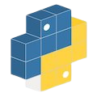
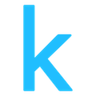

## My Online Presence

{: .btn }
{: .btn }
{: .btn }
{: .btn }
{: .btn }
{: .btn }
{: .btn }
{: .btn }
                                         
## iOS Apps
* [**Programming Notebook PRO**](https://apps.apple.com/us/app/programming-notebook-pro/id1521883614)
* [**Programming Notebook LITE**](https://apps.apple.com/jm/app/programming-notebook-lite/id1519715994)

### Privacy Policy and Information
* None of the above applications collects personal data from any user. The only data collected is that which is collected by Google AdMob when a user interacts with an advertisement. Note that only **Programming Notebook LITE** contains in-app ads, while the others do not. **Programming Notebook PRO** may be purchased for $3.99 USD on the iOS App Store, while **Programming Notebook LITE** is available for free on the iOS App Store. All of the above apps are available on iOS and iPadOS, while they are not made available on macOS and are not made available to Apple Silicon macs for running iOS/iPadOS apps.

## GitHub Projects w/Pages

[John Oliver Voice Cloning](https://ryan-rudes.github.io/john-oliver/){: .btn .btn-blue }
[Minimal Go Explore](https://ryan-rudes.github.io/minimal_goexplore/){: .btn .btn-blue }
[WWDC21 Swift Student Challenge](https://ryan-rudes.github.io/wwdc21/){: .btn .btn-blue }

### Stuff I Use

 

 

 

### Contact Me

  

* Email: ryanrudes@gmail.com
* Phone: +1 516-580-3827

## CV

* [My CV](https://drive.google.com/file/d/1OW_te8njekDXMSS0lOr1WW3_jnr1axRn/view?usp=sharing)

<iframe src="content/CV/CV.pdf#page=1" style="min-height:100vh;width:100%">
This browser does not support PDFs. Please download the PDF to view it: Download PDF
</iframe>
